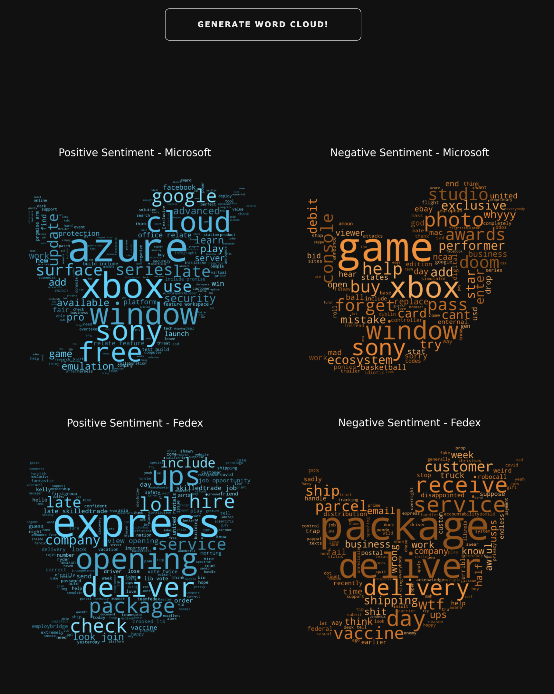

**Product/Service Monitoring System**

This project was inspired `sentdex`. (https://github.com/Sentdex/socialsentiment/)

# What is in this repository

**Jupyter Notebooks**
- `product_service_monitoring_system.ipynb`: contains training and comparing of various models including BERT, TextBlob, and VADER models.

**Python Files**
- `twitter_stream.py`: connects to Twitter API and streamline tweets with various keywords
- `tweet_analyzer.py`: cleans and analyzes streamed tweets
- `app.py`: Dash dashboard

**Folders**
- `images`: contains image files
- `models`: contains (1) BERT NLP and (2) spaCy TF-IF vectorization sentiment analysis models *(*BERT model excluded)*
- `data`: contains SQLite3 databases pulled from Twitter using Tweepy *(only sample database is included)* and `bag_of_words`
- `datasets`: contains datasets that were used to train various NLP sentiment analysis models
- `src`: contains useful codes that were used in creating models
- `keys`: contains Twitter API key information *(*files excluded)*

**How to use this project**

1. Add Twitter API information in `keys` directory, and make sure the PATH is correctly defined in `twitter_stream.py`.
2. Adjust any keywords or queries in `twitter_stream.py`.
3. Set up SQLITE3 database path and run `twitter_stream.py`.
4. Download `BERT_2` model using this <a href='google.com'>test</a> and store it in a directory of your choice.
5. In `tweet_analyzer.py`: 1) correctly set up SQLITE3 database path that matches step #3 and 2) correctly set up pathway for `BERT_2` model.
6. Run `tweet_analyzer.py`
7. Run `app.py`

# Introduction

## Business Case
As of January of 2020, there are approximately 145 million users on Twitter. 22% of Americans are on Twitter and 500 million tweets are sent each day globally. This is why many companies internationally use Twitter for marketing. In fact 80% of Twitter users have mentioned a brand in a tweet, and 77% of Twitter users feel more positive when their tweets have been replied by the mentioned brand [1].

We believe that Twitter is one of the platforms that provides people to share their opinion, evaluations, attitudes, and emotions about virtually anything including certain products freely, and for any companies, this is like a gold mine waiting to be mined for `opinions are central to almost all human activities and are key influencers of our behaviors` [2].
Sources:

[1] https://unsplash.com/photos/ulRlAm1ITMU

[2]. Bing Liu, https://www.morganclaypool.com/doi/abs/10.2200/s00416ed1v01y201204hlt016

## Goals
The goals of this project are to 

    [1] stream Twitter with on various topics (ex. Microsoft, Starbucks, Google, etc.) and
    [2] effectively implement various NLP models (including TextBlob, BERT, and TF-IDF models) to classify tweets
    [3] to flag the user for any strongly negative tweets on a Dashboard to effectively respond to them.

    

# Conclusion

## Models Used

BERT model has accuracy of 84%, however due to its computing time, VADER was used as an initial model to classify polarity of each tweet. The BERT model was used to confirm any strongly negative sentiment tweets classified by VADER.

## Dashboard

**Keyword**
You are able to select up to two keywords to monitor online. If you choose to choose two keywords, you **must** separate them by a comma!

*if no keyword is selected, then it streams 

**Graph1**
This graph represents moving average value of sentiments towards the keywords you have selected along with number of tweets sent.

**Graph2**
This pie graph represents sentiment distribution towards your keyword.

By clicking `Generate Word Cloud`, it generates frequently used words in tweets related to the keywords for each sentiment. 

**Table1**
This table shows recent tweets sent filtered by the keywords chosen. You are able to click on `link` button to access the actual tweet.

**Table2**
This table shows recent flagged tweets that are strongly negative.

**Saving data into .csv file**
You **must** click `GENERATE CSV FILE` before you can download the files. You can either download the whole raw tweet data or just the flagged ones.

## Live Dashboard

* Currently working on deploying the app through Heroku!

# Future Work

1. Database structure
    - As the database size increases, it might get too much for sqlite3 to handle. So, we want to separate database into parts so only when a large number of data is requested, we can combine or join smaller databases. 
2. Reply feature
    - It would be nice if we could add a feature where you could reply to any of tweets shown in the dashboard without going to twitter page.
3. Multiple keywords
    - It would be nice if multiple keywords can be analyzed and followed at a given time.
4. Table Editing Mode
    - Modify flagged tweets in the dashboard so that a user can classify flagged tweets as 'resolved', 'false negative', or 'other' for further customer service / data analysis.
5. Further analysis on both positive and negative tweets
    - Find any correlation between tweet trends with how the company is doing to help with future direction of a company.
